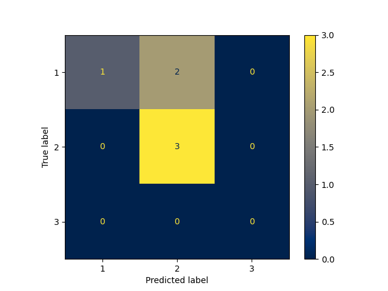
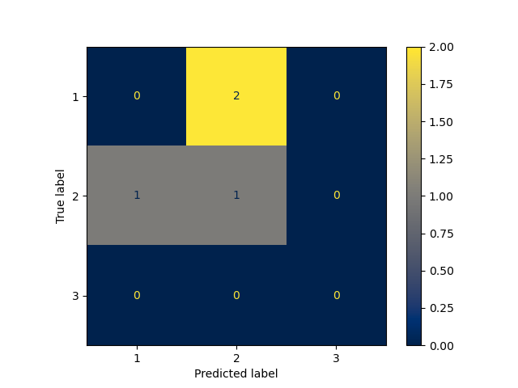

Projekt - 2024/2025 NBA Awards prediction

Aby wybrać wykorzystanie modeli o najlepszym uzyskanym wyniku trzeba ustawić:  
USE_SAVED_MODELS = 1  
w głównym pliku nba_predict.py Natomiast, gdy chcemy wykonać uczenie nowych modeli to konieczne jest ustawienie tego parametru na 0. Znajduje się on bezpośrednio pod sekcją importowanych bibliotek.  
  

* Przygotowanie danych:  
Dane do zbioru dancy zostały pobrane zarówno z API NBA oraz ze strony https://www.basketball-reference.com porałem zaawansowane statystyki graczy.  

Przygotowanie bazy danych w plikach csv z podziałem na ALLNBA i ROOKIE dokonałem za pomocą funkcji dostępnych w pliku prepare_datesets.py  

Następnie już w samym kodzie nba_predict.py po wczytaniu bazy danych odrzucałem zbędne cechy takie jak: PLAYER_ID, NICKNAME, TEAM_ID, TEAM_ABBREVIATION, oraz wszystkie cechy z końcówką _RANK, ponieważ są to duplikaty inforamcji, gdzie surowe dane zostały zamienione na ranking.  

Pobrane dane nie zawierały braków, więc nie było koniecznościu odrzucania lub uzupełniania. Jedyne braki jakie wystąpiły to brak wszystkich zawodników statystykach zaawansowanych, ale tutaj można podjąć prostą decycję, że skoro dany gracz nie posiada statystyk zaawansowanych to tym bardziej nie uzyskał żandej nominacji.  

Sprawdziłem również korelację wszystkich cech. Niektóre cechy nie wpływały w żaden sposób na wynik przypisania do dowonlej piątki. Końcowo zostawiłem 55 cech.  

Cecha PLAYER_NAME to indentyfikator, który również będzie wartością wyjściową wprowadzaną jako wynik do pierwszych piątek. Oczywiście cecha ta jest pomijana w procesie uczenia i predykcji.  

Cecha GP oznacza liczbę rozegranych meczy. Sprawdziłem ile rozegrali meczy zawodnicy w sezonach do 2024, który otrzymali noiminacje do pierwszych piątek i z pewnym zapasem wyznaczyłem granice odrzucania graczy, którzy rozegrali mniej niż 40 meczy dla ALLNBA i 20 meczy dla ROOKIE.  

Cecha POS oznaczała pozycję na której grali zawodnicy. Uzględnianie tej cechy dla ROOKIE tylko pogarszało wynik, więc dla nich jest wyrzucana. Natomiast dla ALLNBA dokonałem klasyfikacji na zmienne numeryczne przez słownik PF,SF = 1, C = 2, SG,PG = 3. Początkowo próbowałem zastosować limit zawodników na danych pozycjach przy umieszczaniu ich w piątkach, ale kończyło się tym, że druga i trzecia piątka nie była wypełniana. Końcowo porzuciłem ograniczanie dobierania graczy do piątek po zakończeniu predykcji, ponieważ i tak nie wpływało to na końcową liczbę przewidzianych porawidłowo zawodników, a przynajmniej posiadałem wypełnione drużyny.  

Wysztkie dane w cechach normalizowałem przez StandardScaler(), ponirważ dawało to najlepszy wynik w porównaniu z brakiem normalizacji i z wykorzystaniem MinMaxScaler().  

Przy przygotowaniu danych do uczenia próbowałem wykorzystać PCA() do odrzucenia mniej istotnych cech, ale tylko pogarszało to wynik.  

Końcowo zdecydowałem się na zostawienie tylko jednego sezonu przy testowaniu modeli.  

* Predykcja:  
Do predykcji zawodników wybrałem podejście głosowania wielu mniejszych modeli umieszczając je w liście. Niektóre modele umieściłęm kilka razy dla innych argumentów. Każdy z modeli po trenowaniu wykonywał predykcję, którą nazwałem głosem w ogólnym głosowaniu. Zliczałem ile głosów dostał każdy zawodnik w każdej piątce, a następnie zgodnie z największą liczbą głosów zawodnicy byli przydzielania do odpowiednich piatek z limitem pięciu miejsc.  
Testowałem różną wagę głosów modeli, które według confusion_matrix() znacznie częściej przewidywały kilka prawidłowych dopasowań przy niewielkiej liczbie pomyłek (1 do 3). Chciałem w ten sposób zwiększyć liczbę poprawnych dopasowań dla drugiej i trzeciej piątki, ale niestety przez te niepoprawne predyckje o większej wadze głosu częściej pogarszało to wynik niż polepszało, wiec końcowo zrezygnowałem z wagi głosów.  

* Zapisywanie modeli:  
Zapisywanie modeli o najlepszych wynikach postanowiłem wykonać ręcznie przez bibliotekę pickle po zakończeniu predykcji

* Dobór modeli:  
Sprawdzałem rózne modele i na podstawie macierzy pomyłek dodawałem model do listy lub odrzucałem go.  
Testując różne kombinacje i testy wykonywane w pętli dotarłem do raczej prostego wniosku, że więcej modeli wcala nie oznacza lepiej. Jednak trafiłem na przypadek, w którym dla całkiem sporej ilości modeli uzyskałem o jedno dopasowanie więcej, więc też taki zapisałem.  

Najlepszy uzyskany wynik to 70%  
Pierwsza piatka ALLNBA zgadniętych = 4  
Druga piatka ALLNBA zgadniętych = 3  
Trzecia piatka ALLNBA zgadniętych = 2  
Pierwsza piatka ROOKIE zgadniętych = 4  
Druga piatka ROOKIE zgadniętych = 4  

Poniżej znajduje się porównaine macierzy pomyłek dla róznych wykorzystyanych modeli.  

<!-- CatBoost dla ALLNBA i ROOKIE -->
<table>
  <tr>
    <td align="center">
       
      <b>CatBoost ALLNBA</b>
    </td>
    <td align="center">
       
      <b>CatBoost ROOKIE</b>
    </td>
  </tr>
</table>

<!-- RandomForest dla ALLNBA i ROOKIE -->
<table>
  <tr>
    <td align="center">
       
      <b>RandomForest ALLNBA</b>
    </td>
    <td align="center">
       
      <b>RandomForest ROOKIE</b>
    </td>
  </tr>
</table>

<!-- LogisticRegression dla ALLNBA i ROOKIE -->
<table>
  <tr>
    <td align="center">
       
      <b>LogisticRegression ALLNBA</b>
    </td>
    <td align="center">
       
      <b>LogisticRegression ROOKIE</b>
    </td>
  </tr>
</table>

<!-- MLPClassifier dla ALLNBA -->
<table>
  <tr>
    <td align="center">
       
      <b>MLPC ALLNBA</b>
    </td>
    <td align="center">
       
      <b>MLPC ALLNBA</b>
    </td>
    <td align="center">
       
      <b>MLPC ALLNBA</b>
    </td>
  </tr>
</table>

<!-- MLPClassifier dla ROOKIE -->
<table>
  <tr>
    <td align="center">
       
      <b>MLPC ROOKIE</b>
    </td>
    <td align="center">
       
      <b>MLPC ROOKIE</b>
    </td>
    <td align="center">
       
      <b>MLPC ROOKIE</b>
    </td>
  </tr>
</table>

<!-- KNNC dla ALLNBA -->
<table>
  <tr>
    <td align="center">
       
      <b>KNC ALLNBA</b>
    </td>
    <td align="center">
       
      <b>KNC ALLNBA</b>
    </td>
    <td align="center">
       
      <b>KNC ALLNBA</b>
    </td>
  </tr>
</table>

<!-- KNNC dla ROOKIE -->
<table>
  <tr>
    <td align="center">
       
      <b>KNC ROOKIE</b>
    </td>
    <td align="center">
       
      <b>KNC ROOKIE</b>
    </td>
    <td align="center">
       
      <b>KNC ROOKIE</b>
    </td>
  </tr>
</table>

<!-- AdaBoostClassifier dla ALLNBA -->
<table>
  <tr>
    <td align="center">
       
      <b>AdaBoost ALLNBA</b>
    </td>
    <td align="center">
       
      <b>AdaBoost ALLNBA</b>
    </td>
    <td align="center">
       
      <b>AdaBoost ALLNBA</b>
    </td>
  </tr>
</table>

<!-- AdaBoostClassifier dla ROOKIE -->
<table>
  <tr>
    <td align="center">
       
      <b>AdaBoost ROOKIE</b>
    </td>
    <td align="center">
       
      <b>AdaBoost ROOKIE</b>
    </td>
    <td align="center">
       
      <b>AdaBoost ROOKIE</b>
    </td>
  </tr>
</table>

